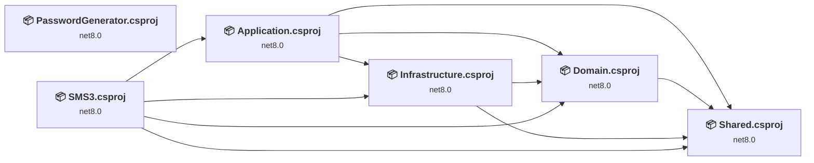
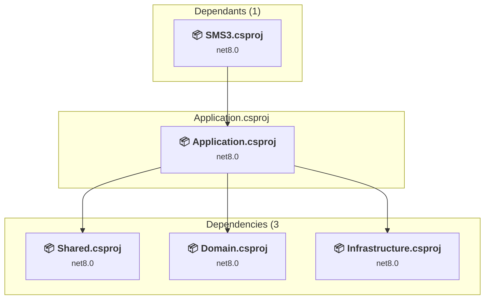
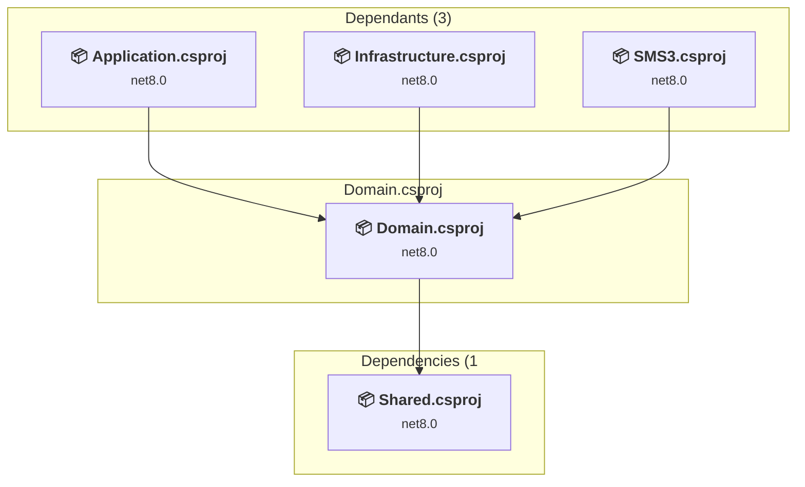
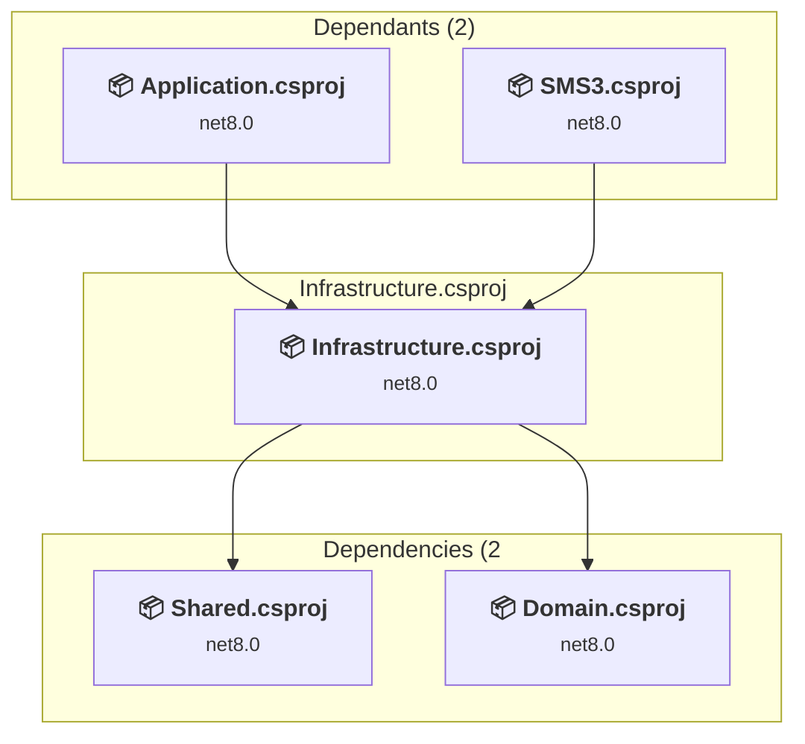
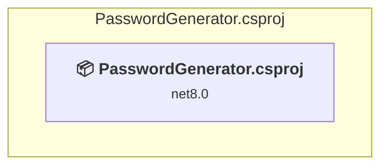
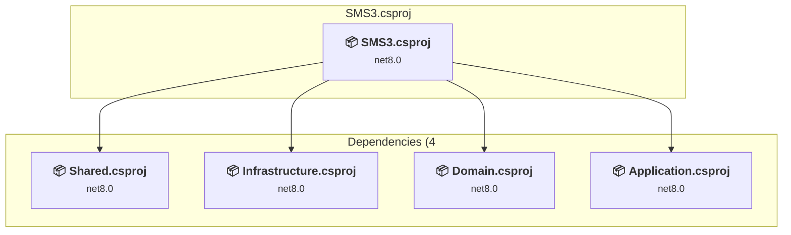
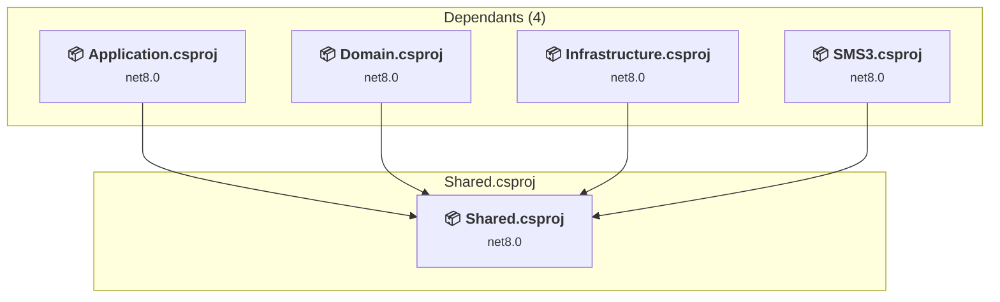

# Projects and dependencies analysis

This document provides a comprehensive overview of the projects and their dependencies in the context of upgrading to .NETCoreApp,Version=v10.0.

## Table of Contents

- [Executive Summary](#executive-Summary)
  - [Highlevel Metrics](#highlevel-metrics)
  - [Projects Compatibility](#projects-compatibility)
  - [Package Compatibility](#package-compatibility)
  - [API Compatibility](#api-compatibility)
- [Aggregate NuGet packages details](#aggregate-nuget-packages-details)
- [Top API Migration Challenges](#top-api-migration-challenges)
  - [Technologies and Features](#technologies-and-features)
  - [Most Frequent API Issues](#most-frequent-api-issues)
- [Projects Relationship Graph](#projects-relationship-graph)
- [Project Details](#project-details)

  - [Application\Application.csproj](#applicationapplicationcsproj)
  - [Domain\Domain.csproj](#domaindomaincsproj)
  - [Infrastructure\Infrastructure.csproj](#infrastructureinfrastructurecsproj)
  - [PasswordGenerator\PasswordGenerator.csproj](#passwordgeneratorpasswordgeneratorcsproj)
  - [Presentation\SMS3\SMS3.csproj](#presentationsms3sms3csproj)
  - [Shared\Shared.csproj](#sharedsharedcsproj)

## Executive Summary

### Highlevel Metrics

| Metric | Count | Status |
| :--- | :---: | :--- |
| Total Projects | 6 | All require upgrade |
| Total NuGet Packages | 17 | 10 need upgrade |
| Total Code Files | 607 |  |
| Total Code Files with Incidents | 30 |  |
| Total Lines of Code | 138611 |  |
| Total Number of Issues | 101 |  |
| Estimated LOC to modify | 73+ | at least 0.1% of codebase |

### Projects Compatibility

| Project | Target Framework | Difficulty | Package Issues | API Issues | Est. LOC Impact | Description |
| :--- | :---: | :---: | :---: | :---: | :---: | :--- |
| [Application\Application.csproj](#applicationapplicationcsproj) | net8.0 | 🟢 Low | 6 | 31 | 31+ | ClassLibrary, Sdk Style = True |
| [Domain\Domain.csproj](#domaindomaincsproj) | net8.0 | 🟢 Low | 2 | 0 |  | ClassLibrary, Sdk Style = True |
| [Infrastructure\Infrastructure.csproj](#infrastructureinfrastructurecsproj) | net8.0 | 🟢 Low | 7 | 1 | 1+ | ClassLibrary, Sdk Style = True |
| [PasswordGenerator\PasswordGenerator.csproj](#passwordgeneratorpasswordgeneratorcsproj) | net8.0 | 🟢 Low | 0 | 0 |  | DotNetCoreApp, Sdk Style = True |
| [Presentation\SMS3\SMS3.csproj](#presentationsms3sms3csproj) | net8.0 | 🟢 Low | 0 | 40 | 40+ | AspNetCore, Sdk Style = True |
| [Shared\Shared.csproj](#sharedsharedcsproj) | net8.0 | 🟢 Low | 7 | 1 | 1+ | ClassLibrary, Sdk Style = True |

### Package Compatibility

| Status | Count | Percentage |
| :--- | :---: | :---: |
| ✅ Compatible | 7 | 41.2% |
| ⚠️ Incompatible | 1 | 5.9% |
| 🔄 Upgrade Recommended | 9 | 52.9% |
| ***Total NuGet Packages*** | ***17*** | ***100%*** |

### API Compatibility

| Category | Count | Impact |
| :--- | :---: | :--- |
| 🔴 Binary Incompatible | 6 | High - Require code changes |
| 🟡 Source Incompatible | 39 | Medium - Needs re-compilation and potential conflicting API error fixing |
| 🔵 Behavioral change | 28 | Low - Behavioral changes that may require testing at runtime |
| ✅ Compatible | 303827 |  |
| ***Total APIs Analyzed*** | ***303900*** |  |

## Aggregate NuGet packages details

| Package | Current Version | Suggested Version | Projects | Description |
| :--- | :---: | :---: | :--- | :--- |
| Asp.Versioning.Mvc | 8.1.1 |  | [SMS3.csproj](#presentationsms3sms3csproj) | ✅Compatible |
| Asp.Versioning.Mvc.ApiExplorer | 8.1.1 |  | [SMS3.csproj](#presentationsms3sms3csproj) | ✅Compatible |
| BCrypt.Net-Next | 4.0.3 |  | [Domain.csproj](#domaindomaincsproj) [PasswordGenerator.csproj](#passwordgeneratorpasswordgeneratorcsproj) | ✅Compatible |
| Microsoft.AspNetCore.Http | 2.2.2 |  | [Application.csproj](#applicationapplicationcsproj) | ⚠️NuGet package is deprecated |
| Microsoft.Data.SqlClient | 6.1.2 |  | [Infrastructure.csproj](#infrastructureinfrastructurecsproj) | ✅Compatible |
| Microsoft.Extensions.Configuration | 8.0.0 | 10.0.8 | [Application.csproj](#applicationapplicationcsproj) [Domain.csproj](#domaindomaincsproj) [Infrastructure.csproj](#infrastructureinfrastructurecsproj) | NuGet package upgrade is recommended |
| Microsoft.Extensions.Configuration.Abstractions | 8.0.0 | 10.0.8 | [Shared.csproj](#sharedsharedcsproj) | NuGet package upgrade is recommended |
| Microsoft.Extensions.Configuration.Json | 8.0.0 | 10.0.8 | [Infrastructure.csproj](#infrastructureinfrastructurecsproj) [Shared.csproj](#sharedsharedcsproj) | NuGet package upgrade is recommended |
| Microsoft.Extensions.Http | 8.0.0 | 10.0.8 | [Infrastructure.csproj](#infrastructureinfrastructurecsproj) | NuGet package upgrade is recommended |
| Microsoft.Extensions.Logging | 8.0.0 | 10.0.8 | [Application.csproj](#applicationapplicationcsproj) [Domain.csproj](#domaindomaincsproj) [Infrastructure.csproj](#infrastructureinfrastructurecsproj) [Shared.csproj](#sharedsharedcsproj) | NuGet package upgrade is recommended |
| Microsoft.Extensions.Logging.Abstractions | 8.0.3 | 10.0.8 | [Shared.csproj](#sharedsharedcsproj) | NuGet package upgrade is recommended |
| Microsoft.Extensions.Logging.Console | 8.0.0 | 10.0.8 | [Application.csproj](#applicationapplicationcsproj) [Infrastructure.csproj](#infrastructureinfrastructurecsproj) [Shared.csproj](#sharedsharedcsproj) | NuGet package upgrade is recommended |
| Microsoft.Extensions.Logging.Debug | 8.0.0 | 10.0.8 | [Application.csproj](#applicationapplicationcsproj) [Infrastructure.csproj](#infrastructureinfrastructurecsproj) [Shared.csproj](#sharedsharedcsproj) | NuGet package upgrade is recommended |
| Microsoft.Extensions.Logging.EventLog | 8.0.0 | 10.0.8 | [Application.csproj](#applicationapplicationcsproj) [Infrastructure.csproj](#infrastructureinfrastructurecsproj) [Shared.csproj](#sharedsharedcsproj) | NuGet package upgrade is recommended |
| Microsoft.FeatureManagement | 3.2.0 |  | [Shared.csproj](#sharedsharedcsproj) | ✅Compatible |
| Radzen.Blazor | 8.3.8 |  | [SMS3.csproj](#presentationsms3sms3csproj) | ✅Compatible |
| Swashbuckle.AspNetCore | 8.1.4 |  | [SMS3.csproj](#presentationsms3sms3csproj) | ✅Compatible |

## Top API Migration Challenges

### Technologies and Features

| Technology | Issues | Percentage | Migration Path |
| :--- | :---: | :---: | :--- |

### Most Frequent API Issues

| API | Count | Percentage | Category |
| :--- | :---: | :---: | :--- |
| M:System.TimeSpan.FromMinutes(System.Double) | 22 | 30.1% | Source Incompatible |
| M:System.TimeSpan.FromSeconds(System.Double) | 17 | 23.3% | Source Incompatible |
| T:System.Uri | 15 | 20.5% | Behavioral Change |
| M:Microsoft.Extensions.DependencyInjection.OptionsConfigurationServiceCollectionExtensions.Configure''1(Microsoft.Extensions.DependencyInjection.IServiceCollection,Microsoft.Extensions.Configuration.IConfiguration) | 5 | 6.8% | Binary Incompatible |
| T:System.Text.Json.JsonDocument | 4 | 5.5% | Behavioral Change |
| M:System.Text.Json.JsonSerializer.Deserialize(System.String,System.Type,System.Text.Json.JsonSerializerOptions) | 3 | 4.1% | Behavioral Change |
| M:System.Uri.#ctor(System.String) | 2 | 2.7% | Behavioral Change |
| M:System.Text.Json.JsonSerializer.Deserialize(System.Text.Json.JsonElement,System.Type,System.Text.Json.JsonSerializerOptions) | 1 | 1.4% | Behavioral Change |
| M:Microsoft.Extensions.Configuration.ConfigurationBinder.Get''1(Microsoft.Extensions.Configuration.IConfiguration) | 1 | 1.4% | Binary Incompatible |
| M:Microsoft.Extensions.Logging.ConsoleLoggerExtensions.AddSimpleConsole(Microsoft.Extensions.Logging.ILoggingBuilder,System.Action{Microsoft.Extensions.Logging.Console.SimpleConsoleFormatterOptions}) | 1 | 1.4% | Behavioral Change |
| P:System.Uri.AbsolutePath | 1 | 1.4% | Behavioral Change |
| M:Microsoft.AspNetCore.Builder.ExceptionHandlerExtensions.UseExceptionHandler(Microsoft.AspNetCore.Builder.IApplicationBuilder,System.String) | 1 | 1.4% | Behavioral Change |

## Projects Relationship Graph

Legend:
📦 SDK-style project
⚙️ Classic project

## Project Details

### Application\Application.csproj

#### Project Info

- **Current Target Framework:** net8.0
- **Proposed Target Framework:** net10.0
- **SDK-style**: True
- **Project Kind:** ClassLibrary
- **Dependencies**: 3
- **Dependants**: 1
- **Number of Files**: 238
- **Number of Files with Incidents**: 10
- **Lines of Code**: 51287
- **Estimated LOC to modify**: 31+ (at least 0.1% of the project)

#### Dependency Graph

Legend:
📦 SDK-style project
⚙️ Classic project

### API Compatibility

| Category | Count | Impact |
| :--- | :---: | :--- |
| 🔴 Binary Incompatible | 1 | High - Require code changes |
| 🟡 Source Incompatible | 21 | Medium - Needs re-compilation and potential conflicting API error fixing |
| 🔵 Behavioral change | 9 | Low - Behavioral changes that may require testing at runtime |
| ✅ Compatible | 41460 |  |
| ***Total APIs Analyzed*** | ***41491*** |  |

### Domain\Domain.csproj

#### Project Info

- **Current Target Framework:** net8.0
- **Proposed Target Framework:** net10.0
- **SDK-style**: True
- **Project Kind:** ClassLibrary
- **Dependencies**: 1
- **Dependants**: 3
- **Number of Files**: 170
- **Number of Files with Incidents**: 1
- **Lines of Code**: 15909
- **Estimated LOC to modify**: 0+ (at least 0.0% of the project)

#### Dependency Graph

Legend:
📦 SDK-style project
⚙️ Classic project

### API Compatibility

| Category | Count | Impact |
| :--- | :---: | :--- |
| 🔴 Binary Incompatible | 0 | High - Require code changes |
| 🟡 Source Incompatible | 0 | Medium - Needs re-compilation and potential conflicting API error fixing |
| 🔵 Behavioral change | 0 | Low - Behavioral changes that may require testing at runtime |
| ✅ Compatible | 10484 |  |
| ***Total APIs Analyzed*** | ***10484*** |  |

### Infrastructure\Infrastructure.csproj

#### Project Info

- **Current Target Framework:** net8.0
- **Proposed Target Framework:** net10.0
- **SDK-style**: True
- **Project Kind:** ClassLibrary
- **Dependencies**: 2
- **Dependants**: 2
- **Number of Files**: 97
- **Number of Files with Incidents**: 2
- **Lines of Code**: 26389
- **Estimated LOC to modify**: 1+ (at least 0.0% of the project)

#### Dependency Graph

Legend:
📦 SDK-style project
⚙️ Classic project

### API Compatibility

| Category | Count | Impact |
| :--- | :---: | :--- |
| 🔴 Binary Incompatible | 1 | High - Require code changes |
| 🟡 Source Incompatible | 0 | Medium - Needs re-compilation and potential conflicting API error fixing |
| 🔵 Behavioral change | 0 | Low - Behavioral changes that may require testing at runtime |
| ✅ Compatible | 37053 |  |
| ***Total APIs Analyzed*** | ***37054*** |  |

### PasswordGenerator\PasswordGenerator.csproj

#### Project Info

- **Current Target Framework:** net8.0
- **Proposed Target Framework:** net10.0
- **SDK-style**: True
- **Project Kind:** DotNetCoreApp
- **Dependencies**: 0
- **Dependants**: 0
- **Number of Files**: 1
- **Number of Files with Incidents**: 1
- **Lines of Code**: 127
- **Estimated LOC to modify**: 0+ (at least 0.0% of the project)

#### Dependency Graph

Legend:
📦 SDK-style project
⚙️ Classic project

### API Compatibility

| Category | Count | Impact |
| :--- | :---: | :--- |
| 🔴 Binary Incompatible | 0 | High - Require code changes |
| 🟡 Source Incompatible | 0 | Medium - Needs re-compilation and potential conflicting API error fixing |
| 🔵 Behavioral change | 0 | Low - Behavioral changes that may require testing at runtime |
| ✅ Compatible | 121 |  |
| ***Total APIs Analyzed*** | ***121*** |  |

### Presentation\SMS3\SMS3.csproj

#### Project Info

- **Current Target Framework:** net8.0
- **Proposed Target Framework:** net10.0
- **SDK-style**: True
- **Project Kind:** AspNetCore
- **Dependencies**: 4
- **Dependants**: 0
- **Number of Files**: 236
- **Number of Files with Incidents**: 14
- **Lines of Code**: 44712
- **Estimated LOC to modify**: 40+ (at least 0.1% of the project)

#### Dependency Graph

Legend:
📦 SDK-style project
⚙️ Classic project

### API Compatibility

| Category | Count | Impact |
| :--- | :---: | :--- |
| 🔴 Binary Incompatible | 4 | High - Require code changes |
| 🟡 Source Incompatible | 18 | Medium - Needs re-compilation and potential conflicting API error fixing |
| 🔵 Behavioral change | 18 | Low - Behavioral changes that may require testing at runtime |
| ✅ Compatible | 214638 |  |
| ***Total APIs Analyzed*** | ***214678*** |  |

### Shared\Shared.csproj

#### Project Info

- **Current Target Framework:** net8.0
- **Proposed Target Framework:** net10.0
- **SDK-style**: True
- **Project Kind:** ClassLibrary
- **Dependencies**: 0
- **Dependants**: 4
- **Number of Files**: 3
- **Number of Files with Incidents**: 2
- **Lines of Code**: 187
- **Estimated LOC to modify**: 1+ (at least 0.5% of the project)

#### Dependency Graph

Legend:
📦 SDK-style project
⚙️ Classic project

### API Compatibility

| Category | Count | Impact |
| :--- | :---: | :--- |
| 🔴 Binary Incompatible | 0 | High - Require code changes |
| 🟡 Source Incompatible | 0 | Medium - Needs re-compilation and potential conflicting API error fixing |
| 🔵 Behavioral change | 1 | Low - Behavioral changes that may require testing at runtime |
| ✅ Compatible | 71 |  |
| ***Total APIs Analyzed*** | ***72*** |  |

